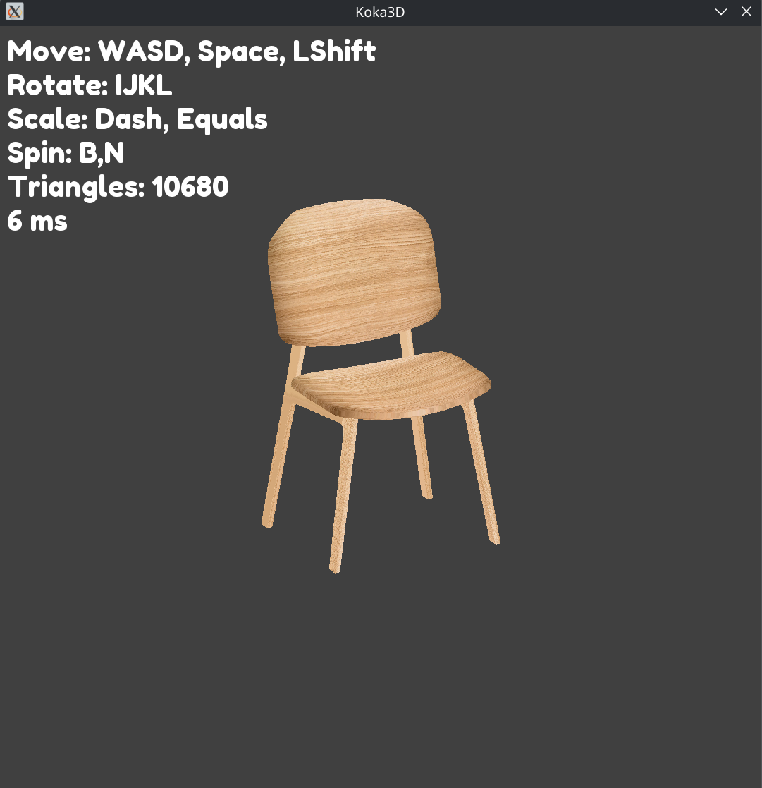
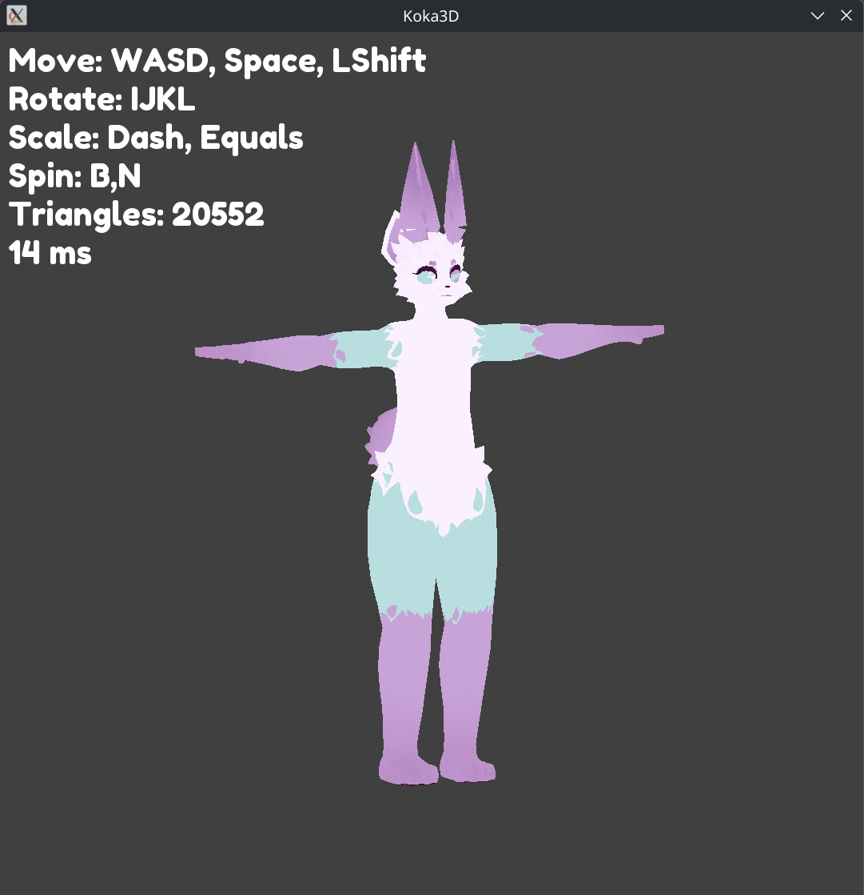

koka3D is a rendering program I wrote to better understand the math behind the graphics pipeline.
Most of the math is done on the CPU, which includes parsing, assembly, vertex transformations, and z-sorting.
Actual drawing is done by SFML's DrawTriangles function.

This project required me to understand applications of data structures, linear algebra, data-stream interpretation, and input handling.
Some fun challenges were parsing, matrices, and UV application, and sorting.

 

Features: 
- Load any model through OBJ Parsing.  
- Load any texture to any model.  
- Controls to transform the model.  
- Frame time performance metrics

Usage: 
- Open the binary through the executable  
- Input a model located in assets/model/  
- Input a texture located in texture/

Dependencies:  
- SFML 2.6.2

Credits:
- "laika" created by Laika.
- Other models and textures are original.
